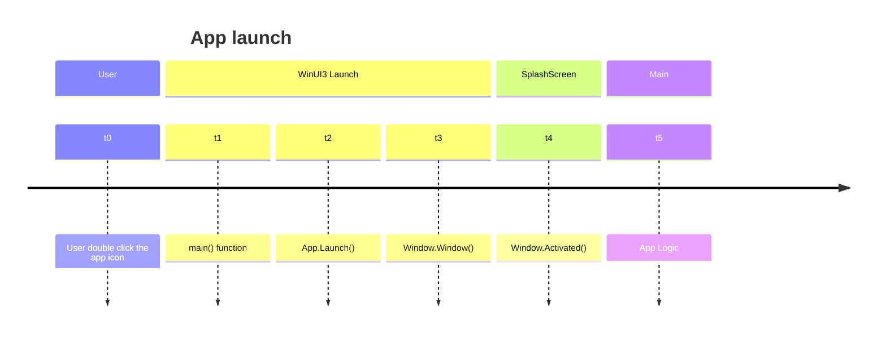

# SplashScreenDemo (WIP)
This is a demo project to show how to create a perfect splashscreen for a winui3 app (in my opinion).

A good splashscreen should be somewhat similar to UWP's implementation, that ideally achieve:
- Fast to startup
- Show some basic UI element (like the logo, a progress bar if possible)
- Seamless transition to the main window (if exist)
- Ideally use as little resource as possible

So in the next section, let's discuss them one-by-one.

## Fast startup
This is the single most important aspect of the splashscreen. We will discuss some of the alternatives here.
### In-App Splashscreen
This is trivial to implement. We just add a `Page` in our winui3 app, and then make a transition animation when our 
main app logic is ready and can be ready to load. Let's test in theory, how fast it could be.

We can measure the time it takes from **a user double click the app icon** to **window shown** by simulating launching
the app via code, passing the current time point `(t0)` in the command line, then measure the time at `Window.Activated`
`(t4)`, and then calculate the difference `(t4 - t0)`. A diagram for this:

I build both a C++ demo and a C# demo, and a C++ launcher to consecutively launch them 5 times, and record the time point.
Test are run with:
- Ryzen 7 1700 @3.8Ghz
- 64GB DDR4 2400Mhz
- Windows 11 24H2
- Windows App SDK 1.6.250228001

**Units are all in milliseconds.

C++ Result:

| t1 `main()` | t2 `App.Launch` | t3 `Window.Window()` | t4 `Window.Activated()` |
|-------------|-----------------|----------------------|-------------------------|
| 161| 256 | 307 | 318 |
|154 | 239 | 287 | 299 | 
|156 | 245 | 293 | 303
|150 | 240 | 289 | 301
|155 | 241 | 289 | 300

C# Result:

| t1 `main()` | t2 `App.Launch` | t3 `Window.Window()` | t4 `Window.Activated()` |
|-------------|-----------------|----------------------|-------------------------|
| 182 | 324 | 383 | 401
| 182 | 315 | 371 | 389
| 178 | 312 | 367 | 386
| 176 | 313 | 370 | 389
| 180 | 316 | 372 | 391

C++ SplashScreen component result: (we don't have `App.Launch()` here)

| t1 `main()` | t3 `Window.Window()` | t4 `Window.Activated()` |
|-------------|----------------------|-------------------------|
| 53 | 53 | 74
| 47 | 47 | 69
| 48 | 48 | 69
| 46 | 46 | 69
| 52 | 52 | 77

### Standalone Splashscreen
A standalone splashscreen could be way faster than 300 ms (C++) or 390 ms (C#).  