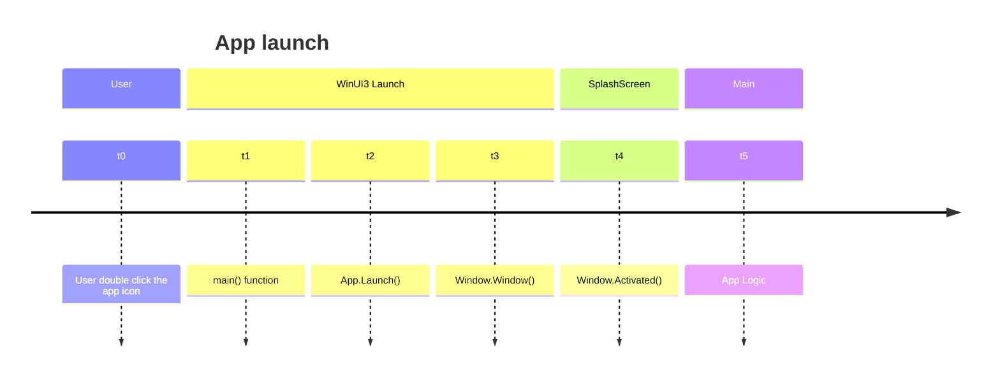
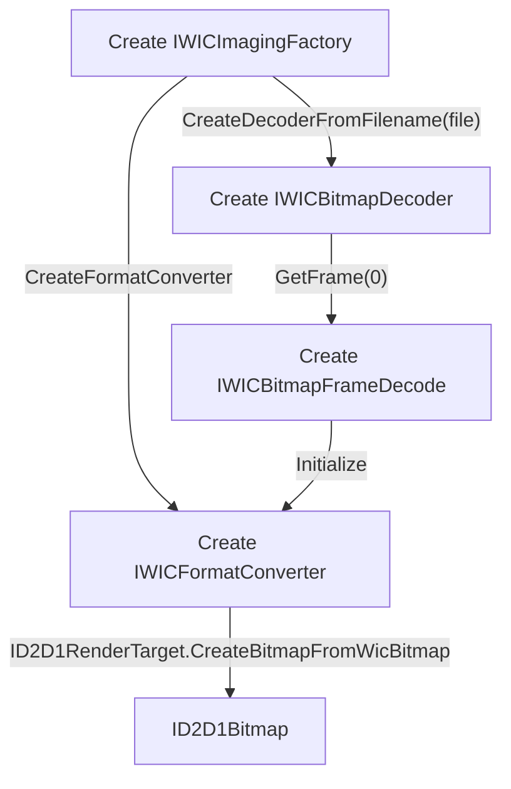
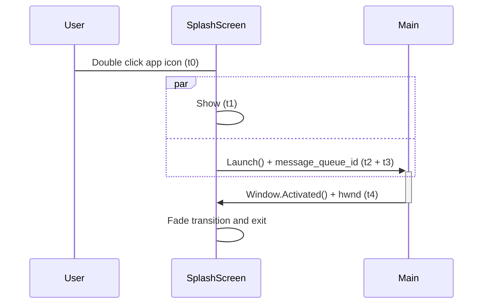

# SplashScreenDemo (WIP)
This is a demo project to show how to create a perfect splashscreen for a winui3 app (in my opinion).

>[!Note]
> To build this project, you need to have [vcpkg](https://vcpkg.io/) integration installed.

A good splashscreen should be somewhat similar to UWP's implementation, that ideally achieve:
- Fast to startup
- Show some basic UI element (like the logo, a progress bar if possible)
- Seamless transition to the main window (if exist)
- Ideally use as little resource as possible

So in the next section, let's discuss them one-by-one.

----
## Fast startup
This is the single most important aspect of the splashscreen. We will discuss some of the alternatives here.
### In-App Splashscreen
This is trivial to implement. We just add a `Page` in our winui3 app, and then make a transition animation when our 
main app logic is ready and can be ready to load. Let's test in theory, how fast it could be.

We can measure the time it takes from **a user double click the app icon** to **window shown** by simulating launching
the app via code, passing the current time point `(t0)` in the command line, then measure the time at `Window.Activated`
`(t4)`, and then calculate the difference `(t4 - t0)`. A diagram for this:

I build both a C++ demo and a C# demo, and a C++ launcher to consecutively launch them 5 times, and record the time point.
Test are run with:
- Ryzen 7 1700 @3.8Ghz
- 64GB DDR4 2400Mhz
- Windows 11 24H2
- Windows App SDK 1.6.250228001

**Units are all in milliseconds.

C++ Result:

| t1 `main()` | t2 `App.Launch` | t3 `Window.Window()` | t4 `Window.Activated()` |
|-------------|-----------------|----------------------|-------------------------|
| 161| 256 | 307 | 318 |
|154 | 239 | 287 | 299 | 
|156 | 245 | 293 | 303
|150 | 240 | 289 | 301
|155 | 241 | 289 | 300

C# Result:

| t1 `main()` | t2 `App.Launch` | t3 `Window.Window()` | t4 `Window.Activated()` |
|-------------|-----------------|----------------------|-------------------------|
| 182 | 324 | 383 | 401
| 182 | 315 | 371 | 389
| 178 | 312 | 367 | 386
| 176 | 313 | 370 | 389
| 180 | 316 | 372 | 391

### Standalone Splashscreen
A standalone splashscreen could be way faster than 300 ms (C++) or 390 ms (C#).  

C++ SplashScreen component result: (we don't have `App.Launch()` here)

| t1 `main()` | t3 `Window.Window()` | t4 `Window.Activated()` |
|-------------|----------------------|-------------------------|
| 53 | 53 | 74
| 47 | 47 | 69
| 48 | 48 | 69
| 46 | 46 | 69
| 52 | 52 | 77

## Show some basic UI element
### Drawing the logo
We use [Windows Imaging Component](https://learn.microsoft.com/en-us/windows/win32/wic/-wic-lh) to decode our `png` logo file.

### Drawing the progress bar
The winui3 `ProgressBar` style is not in the `generic.xaml`, but in [the github repo](https://github.com/microsoft/microsoft-ui-xaml/blob/3b4ee2bd3de498e27517e82cf840acd000970ffc/src/controls/dev/ProgressBar/ProgressBar.xaml).
Let's break down what it is composed of: 

## Seamless transition to the main window
We break down what "seamless" mean by examaing how UWP splashscreen compose of.

### Sync window move with main window
You can create a `boost::interprocess::message_queue` in your splashscreen component,
naming it with a timestamp (so that you can run multiple instances and not interfering each other) `message_queue_id` 
and passing it to the main app via command line.
Then in the main app, you do your initialization logic. 
When it's ready, you create your window, and pass the window handle `hwnd` to the splashscreen component with the `boost::interprocess::message_queue`. 
Then you can sync your splashscreen window moving with your main window during the transition animation.

### Transition animation (WIP)
